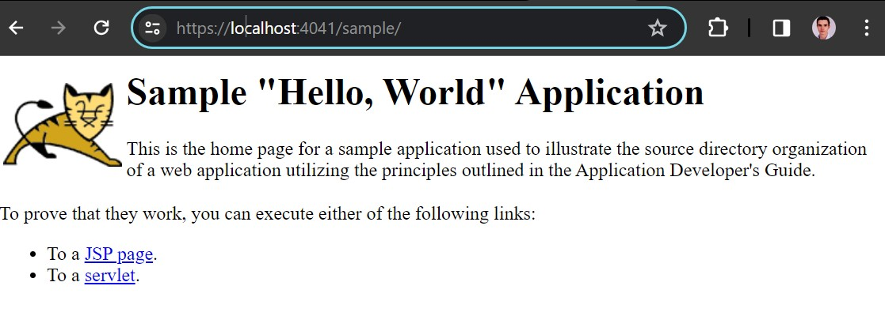
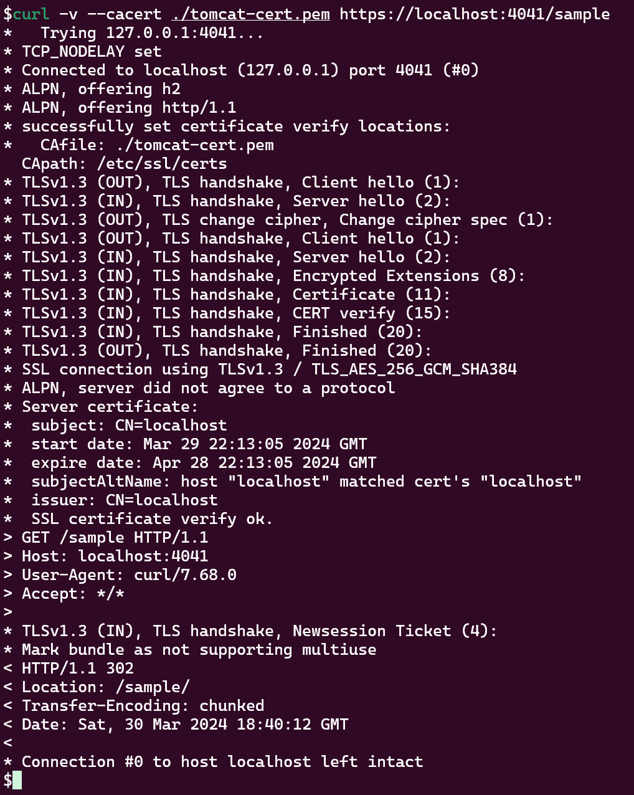

# Example Tomcat App with SSL/TLS enabled

This project automates the setup of a Tomcat server within a Docker container, utilizing SSL/TLS for secure communications. It includes a script to generate SSL certificates if they don't exist, build a Docker image, and run a containerized instance of Tomcat.

## Prerequisites

- Docker: The project requires Docker to build and run the Tomcat container.
- OpenSSL: Used for generating SSL certificates for secure communication.

## Getting Started

Follow these steps to get your Tomcat server running:

1. Run the bash script to build the Docker image and run the container:

    ```bash
    ./script.sh
    ```

2. Access the sample web app via a web browser at:
    - [https://localhost:4041/sample]([sample_web_app.jpg](https://localhost:4041/sample))

3. Result:



## Setup guide

1. Create a Dockerfile
   - Include instructions to install Tomcat.
   - Install additional packages if needed using package managers like yum (the default package manager for CentOS).
2. Customize Tomcat server.xml file to change the port and enable SSL/TLS:
   - Start by temporarily run the Tomcat application to copy the default server.xml to your host for modifications. Use a docker command to achieve this:

    ```bash
    #check your running container and get the <container_id>:
    docker ps
    #Copy the server.xml file
    docker cp <container_id>:/usr/local/tomcat/conf/server.xml ./server.xml
    ```

3. Modify server.xml to define an SSL connector with custom ports and enable SSL/TLS.
   - Ensure the modified server.xml gets copied back into your Docker image in the Dockerfile.
     - To achieve this step, make sure you have the openssl to convert your PEM files to a supported format, such as PKCS12, which Tomcat can utilize for SSL/TLS configuration.
4. Create a Bash Script for Automation:
   - Generate PEM Certificate and Key Files:
     - Use openssl to create a self-signed certificate and private key for SSL/TLS.
   - Build the Docker Image:
     - Include a command in your script to build the Docker image using your Dockerfile.
   - Run the Container
   - Finally, add a command to run your Docker container and mapping necessary ports

> **_NOTES:_**
>
>- The self-signed SSL certificate is generated automatically during the script execution.
>- This example was done in a local environment using Ubuntu 22.04
>- The included script will not check for these prerequisites.
>
>- To avoid certificate warnings during development, generate and trust a locally signed certificate for your local web server, ensuring seamless HTTPS testing.
>   - Instructions for this are not provided as this can vary from each setup. You can always see you certificate by running this command:
>
> ```bash
> curl -v --cacert your-certificate.pem https://localhost:4041/sample
> ```


